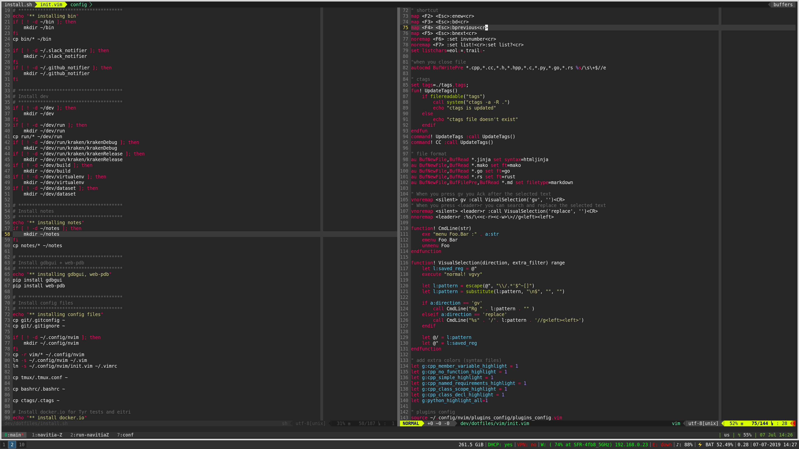

# Personnal work flow and tools

All the configuration is installed with 
[Red Hat Ansible](https://github.com/ansible/ansible) tool.

The main configuration is composed of : I3 + Tmux + Zsh + Nvim



## Set up

Please create **vault_passwd** file at the root of the repository,
 with the vault password inside

Full installation.i\n
It consists in installing all packages and
 configuration files (User password is required for packages installation)

```bash
./install
```

Only update config file

``` bash
./install update
```

## Doc

[Key binding](https://github.com/benoit-bst/dotfiles/blob/master/keybinding.md)
